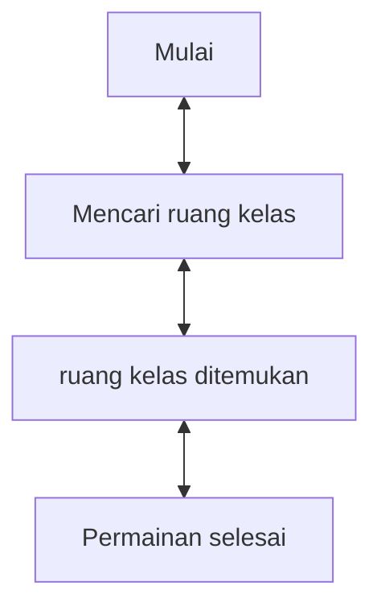

# Game "Mencari Ruang Kelas"
## 1. Latar Belakang
  
 Game merupakan media hiburan yang dapat di gunakan untuk setiap orang dan dapat digunakan untuk menghilangan rasa jenuh. Dalam projek ini saya membuat game yang bernama Mencari Ruang Kelas. Jadi game ini adalah seseorang yang sedang mencari ruang kelas untuk dapat belajar di ruangan tersebut

 
## 2. Deksripsi
  Game "Mencari Ruang Kelas" ini merupakan game sederhana yang sangat seru dan menyenangkan. Game ini bercerita tentang seorang yang sedang mencari ruang kelas di suatu kampus untuk dapat belajar dan mencari ilmu. Saat seseorang berada di kampus, semua hal yang ia lakukan hanya mencari-cari ruang kelas untuk belajar. Inti dari game ini player dapat melakukan atau mencari ruangan yang dia tempati untuk belajar. Disarankan pada player untuk memainkan game sederhana ini agar tidak bosan.

## 3. Branding
### A. Nama/Merk Game :
Mencari Ruang Kelas
### B. Deskripsi Target User :
- Usia 10 tahun ke atas
- Seorang yang mencari hiburan saat bermain game
### C. Genre :
- Simulation

## 4. User Story

Sebagai | Saya Ingin Bisa | Sehingga | Prioritas
---|---|---|---
PLayer | Bergerak ke mana-mana | Bisa mengeksplorasi kampus | ⭐⭐⭐⭐⭐
Player | Menemukan kelas | Bisa belajar | ⭐⭐⭐⭐⭐

## 5. Desain User Interface

## 6. Flowchart dari Algoritma

## 7. Link demo game di youtube

[In Progress]

## 8. Link folder kode pemrograman dari game

[In Progress]

## 9. Game menerapkan prinsip-prinsip dasar pemrograman seperti

    A. Variable
    B. Data type
    C. Operator
    D. Boolean
    E. Conditions: If / else / switch
    F. Looping: while / for
    G. Array
    H. Method
    I. Class

