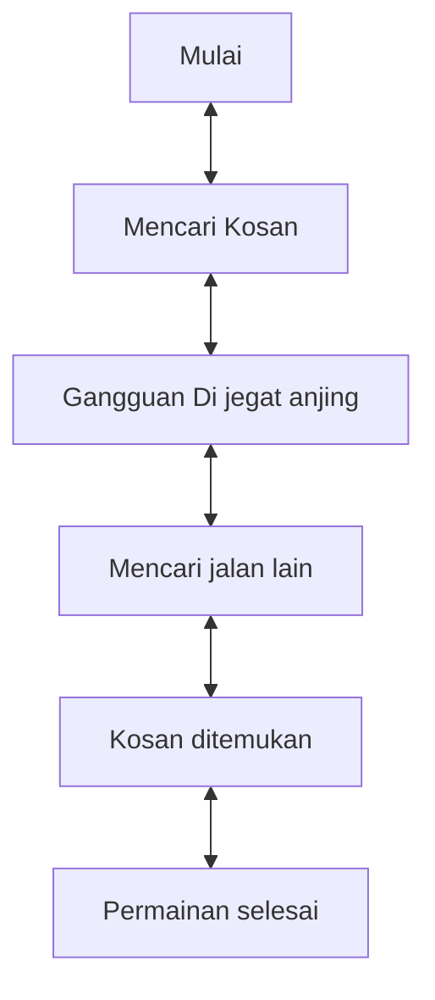

# Game "Mencari Kosan"
## 1. Latar Belakang
  
 Game merupakan media hiburan yang dapat di gunakan untuk setiap orang dan dapat digunakan untuk menghilangkan rasa jenuh. Dalam projek ini saya membuat game yang bernama Mencari Kosan. Jadi game ini adalah seseorang yang sedang mencari kosan untuk dapat berteduh di kosan tersebut. Pada saat dia sedang berjalan menuju kosan, dia di jegat oleh seekor anjing. Dia pun berpikir untuk mencari jalan lain. Pada saat dia mencari jalan lain dia menemukan jalan tersebut, dia menggunakan jalan itu dan pada akhirnya dia menemukan kosan yang ingin dia tempati untuk berteduh.

 
## 2. Deksripsi
  Game "Mencari Kosan" ini merupakan game sederhana yang sangat seru dan menyenangkan. Game ini bercerita tentang seorang yang sedang mencari kosan di suatu daerah untuk dapat berteduh. Pada Saat sedang diperjalanan untuk mencari kosan, ia dijegat oleh seekor anjing. Mau ga mau ia harus mencari jalan lain agar menemukan kosan tersebut, Dan pada akhir nya ia menemukan kosan setelah melalui banyak rintangan. Inti dari game ini player dapat melakukan atau mencari kosan yang dia tempati untuk berteduh. Game ini disarankan pada player untuk memainkan game sederhana ini agar tidak bosan.

## 3. Branding
### A. Nama/Merk Game :
Mencari Kosan
### B. Deskripsi Target User :
- Usia 10 tahun ke atas
- Seorang yang mencari hiburan saat bermain game
### C. Genre :
- Simulation

## 4. User Story

Sebagai | Saya Ingin Bisa | Sehingga | Prioritas
---|---|---|---
Player | Berjalan menuju kosan | Bisa Berteduh | ⭐⭐⭐⭐⭐
Player | Menemukan kosan | Bisa untuk beristirahat | ⭐⭐⭐⭐⭐
Player | Menemukan jalan lain | Bisa terhindar dari kejaran seekor anjing | ⭐⭐⭐⭐

## 5. Desain User Interface

## 6. Flowchart dari Algoritma

## 7. Link demo game di youtube

[In Progress]

## 8. Link folder kode pemrograman dari game

[In Progress]

## 9. Game menerapkan prinsip-prinsip dasar pemrograman seperti

   - Variable
   - Data Type
   - Operator
   - Boolean
   - Conditions: if / else / switch
   - Looping: while / for
   - Array
   - Method
   - Class

