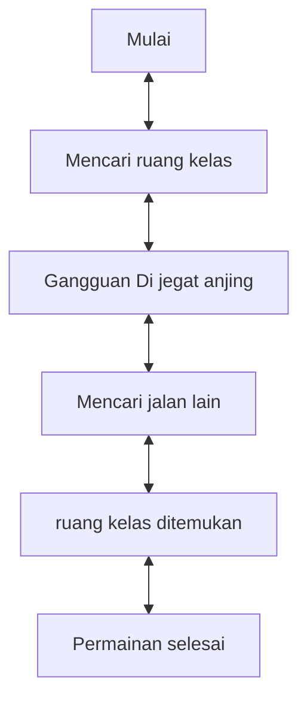

# Game "Mencari Ruang Kelas"
## 1. Latar Belakang
  
 Game merupakan media hiburan yang dapat di gunakan untuk setiap orang dan dapat digunakan untuk menghilangkan rasa jenuh. Dalam projek ini saya membuat game yang bernama Mencari Ruang Kelas. Jadi game ini adalah seseorang yang sedang mencari ruang kelas untuk dapat belajar di ruangan tersebut. Pada saat dia sedang berjalan menuju kelas, dia di jegat oleh seekor anjing. Dia pun berpikir untuk mencari jalan lain. Pada saat dia mencari jalan lain dia menemukan jalan tersebut, dia menggunakan jalan itu dan pada akhirnya dia menemukan kelas yang ingin dia tempati untuk belajar.

 
## 2. Deksripsi
  Game "Mencari Ruang Kelas" ini merupakan game sederhana yang sangat seru dan menyenangkan. Game ini bercerita tentang seorang yang sedang mencari ruang kelas di suatu gedung untuk dapat belajar dan mencari ilmu. Pada Saat sedang diperjalanan untuk mencari kelas, ia dijegat oleh seekor anjing. Mau ga mau ia harus mencari jalan lain agar menemukan kelas untuk belajar, Dan pada akhir nya ia menemukan kelas tersebut. Inti dari game ini player dapat melakukan atau mencari kelas yang dia tempati untuk belajar. Game ini disarankan pada player untuk memainkan game sederhana ini agar tidak bosan.

## 3. Branding
### A. Nama/Merk Game :
Mencari Ruang Kelas
### B. Deskripsi Target User :
- Usia 10 tahun ke atas
- Seorang yang mencari hiburan saat bermain game
### C. Genre :
- Simulation

## 4. User Story

Sebagai | Saya Ingin Bisa | Sehingga | Prioritas
---|---|---|---
Player | Berjalan menuju kelas | Bisa tempati kelas | ⭐⭐⭐⭐⭐
Player | Menemukan kelas | Bisa untuk belajar | ⭐⭐⭐⭐⭐
Player | Menemukan jalan lain | Bisa terhindar dari kejaran seekor anjing | ⭐⭐⭐⭐⭐

## 5. Desain User Interface

## 6. Flowchart dari Algoritma

## 7. Link demo game di youtube

[In Progress]

## 8. Link folder kode pemrograman dari game

[In Progress]

## 9. Game menerapkan prinsip-prinsip dasar pemrograman seperti

   - Variable
   - Data Type
   - Operator
   - Boolean
   - Conditions: if / else / switch
   - Looping: while / for
   - Array
   - Method
   - Class

