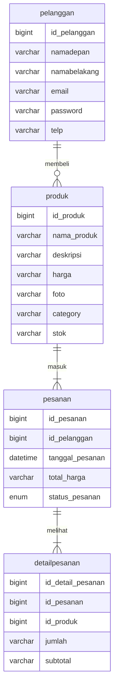
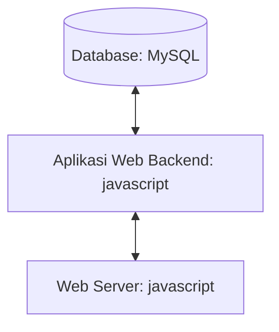

## 1.1 Latar Belakang

 Saya diprojek ini membuat website Toko Mamah Online. Toko Mamah Online adalah sebuah website yang menjual brand pakaian lokal yang original tidak kw. Pakaian adalah sebuah kebutuhan primer manusia selain makanan dan minuman. Jadi saya membuat website ini untuk memudahkan masyarakat dalam membeli pakaian agar tidak keluar rumah.

## 1.2. Deksripsi Teknologi Informasi

Website ini bertujuan untuk memudahkan masyarakat untuk membeli pakaian agar tidak keluar rumah. Maka dengan website ini orang bisa membeli pakaian kapan ajah tanpa harus datang langsung ke Toko Offline.

## 1.3. Branding
 - merk: Toko Mamah Online
 - Tagline: "kamu mau membeli pakaian? pesan di sini ajh."
 - Campaign: Silahkan untuk melakukan pembelian pakaian
 - Target User:
    -Usia: 10 tahun ke atas
    -Orang yang ingin membeli produk pakaian tanpa harus datang ke toko offline.
 - User Experience Theme:
    -Sederhana
    -Mudah
    
## 2. User Story

Sebagai | Saya ingin bisa | Sehingga | Prioritas
---|---|---|---
Pelanggan | Memesan produk | Bisa membeli produk tersebut | ⭐⭐⭐⭐⭐
pelanggan | Membeli produk | Bisa dipake saat dibeli | ⭐⭐⭐⭐⭐
pelanggan | Mengetahui Size & Chart | Bisa memilih ukuran produk yang pas | ⭐⭐⭐⭐⭐
pelanggan | Mendaftar | Bisa membeli produk | ⭐⭐⭐⭐
pelanggan | login | Bisa masuk ke halaman utama dan membeli produk | ⭐⭐⭐⭐
pelanggan | Mengetahui Tips & Trick | Bisa memilih produk agar tidak salah | ⭐⭐⭐⭐
pelanggan | Melihat detail produk | Bisa melihat produk | ⭐⭐⭐

## 3. Struktur Data

## 4. Arsitektur Sistem

## 5. Teknologi, Library, dan Framework

Untuk teknologi saya menggunakan Visual Studio Code

## 6. Desain User Experience dan User Interface

## 7. Demonstrasi Video

## 8. Bagaimana mesin komputasi dan sistem operasi berperan dalam produk teknologi informasimu ?

## 9. Bagaimana algoritma, struktur data, dan bahasa pemrograman berperan dalam produk teknologi informasimu ?

## 10. Bagaimana metode pengembangan perangkat lunak / Software Development Life Cycle berperan dalam produk teknologi informasimu ?

## 11. Bagaimana database / sistem basis data berperan dalam produk teknologi informasimu ?

