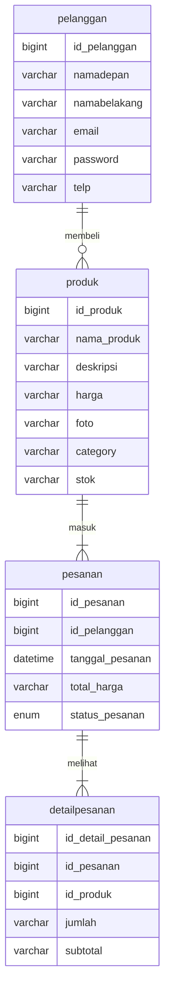
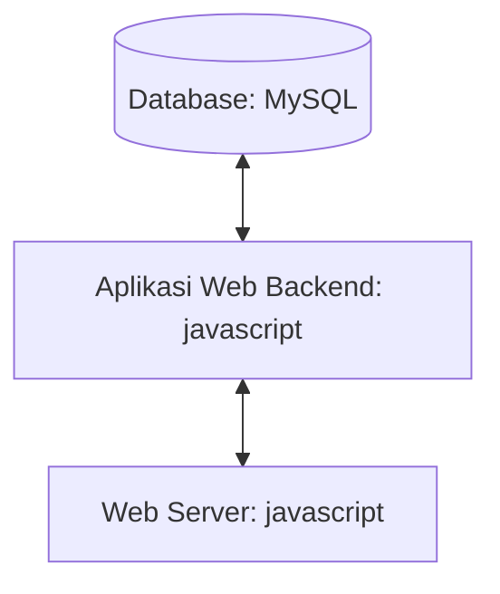

## 1.1 Latar Belakang
Saya diprojek ini membuat website Toko Mamah Online. Toko Mamah Online adalah sebuah website yang menjual brand pakaian lokal yang original tidak kw. Pakaian adalah sebuah kebutuhan primer manusia selain makanan dan minuman. Jadi saya membuat website ini untuk memudahkan masyarakat dalam membeli pakaian agar tidak keluar rumah.

## 1.2. Deksripsi Teknologi Informasi
Website ini bertujuan untuk memudahkan masyarakat untuk membeli pakaian agar tidak keluar rumah. Maka dengan website ini orang bisa membeli pakaian kapan ajah tanpa harus datang langsung ke Toko Offline.

## 1.3. Branding
 - merk: Toko Mamah Online
 - Tagline: "kamu mau membeli pakaian? pesan di sini ajh."
 - Campaign: Silahkan untuk melakukan pembelian pakaian
 - Target User:
    - Usia: 10 tahun ke atas
    - Orang yang ingin membeli produk pakaian tanpa harus datang ke toko offline.
 - User Experience Theme:
    - Sederhana
    - Mudah
    - Inspirasi Desain
      
      

    
## 2. User Story

Sebagai | Saya ingin bisa | Sehingga | Prioritas
---|---|---|---
Pelanggan | Mendaftar | Bisa membeli produk yang ingin di pesan | ⭐⭐⭐⭐⭐
Pelanggan | Login | Bisa masuk ke halaman utama dan membeli produk | ⭐⭐⭐⭐⭐
Pelanggan | Mencari produk | Bisa mengetahui produk apa ajah yang di jual | ⭐⭐⭐⭐⭐
Pelanggan | Memesan produk | Bisa membeli produk tersebut | ⭐⭐⭐⭐⭐
Pelanggan | Membeli produk | Bisa dipake saat dibeli | ⭐⭐⭐⭐⭐
Pelanggan | Mengetahui Size & Chart | Bisa memilih ukuran produk yang pas | ⭐⭐⭐⭐⭐
Pelanggan | Mengetahui Tips & Trick | Bisa memilih produk agar tidak salah | ⭐⭐⭐⭐
Pelanggan | Melihat detail produk | Bisa melihat produk yang sudah di pesan | ⭐⭐⭐

## 3. Struktur Data

## 4. Arsitektur Sistem

## 5. Teknologi, Library, dan Framework
1. MYSQL
   - MySQL merupakan sistem manajemen database yang bersifat open-source yang menggunakan perintah dasar atau bahasa pemrograman yang berupa structured query language (SQL) yang cukup populer di dunia teknologi. MySQL berguna sebagai database. Fungsi utama MySQL adalah mengelola informasi di database pada sisi server dengan bahasa pemrograman SQL. Saat ini, hampir seluruh pihak hosting menyediakan MySQL untuk pengembangan web.

2. Visual Studio Code
   - Visual Studio Code adalah aplikasi code editor buatan Microsoft yang dapat dijalankan di semua perangkat desktop secara gratis. Kelengkapan fitur dan ekstensi membuat code editor ini menjadi pilihan utama para pengembang. Visual Studio Code bahkan mendukung hampir semua sistem operasi seperti Windows, Mac OS, Linux, dan lain sebagainya.
  
3. Javascript
    - JavaScript adalah bahasa pemrograman yang digunakan dalam pengembangan website agar lebih dinamis dan interaktif. Kalau sebelumnya kamu hanya mengenal HTML dan CSS, nah sekarang kamu jadi tahu bahwa JavaScript dapat meningkatkan fungsionalitas pada halaman web. Bahkan dengan JavaScript ini kamu bisa membuat aplikasi, tools, atau bahkan game pada web. 

5. Figma
   - Figma adalah salah satu tools berbasis website yang digunakan untuk mendesain kapan saja dan dimanapun melalui internet. Pada umumnya Figma digunakan untuk mendesain interface dari sebuah aplikasi yang ingin dibuat. Dalam pengerjaan sebuah aplikasi baru, Figma dapat dimanfaatkan untuk membangun aplikasi tersebut bersama tim. Basis Operating System yang dapat menjalankan figma adalah Windows dan mac OS untuk desktop.
     
6. Windows
   - Sistem operasi Windows adalah sebuah program komputer yang mengatur semua sumber daya komputer dan menyediakan layanan kepada aplikasi yang berjalan di atasnya. Sistem operasi ini dikembangkan oleh perusahaan Microsoft dan dirilis pada tahun 1985 dengan nama Windows 1.0. Sejak saat itu, sistem operasi Windows terus berkembang dan menjadi salah satu sistem operasi paling populer di dunia.  Sistem operasi Windows dirancang untuk berjalan pada berbagai jenis perangkat keras, termasuk desktop, laptop, server, dan perangkat mobile. Windows menggunakan antarmuka pengguna grafis (GUI) yang memungkinkan pengguna untuk berinteraksi dengan komputer melalui ikon, tombol, dan menu visual, daripada menggunakan perintah teks seperti sistem operasi lain. Windows juga memiliki banyak fitur seperti kemampuan multitasking, yang memungkinkan beberapa aplikasi berjalan secara bersamaan, serta kemampuan plug-and-play yang memudahkan pengguna dalam menghubungkan perangkat tambahan seperti printer, scanner, dan kamera. 

## 6. Desain User Experience dan User Interface
url Figma nya : https://www.figma.com/file/RO5AsJPWUQDULrktwPSZoZ/Baidhowi-Al-Huseini-Hakiki?type=design&node-id=0-1&mode=design&t=DQaYnYK1MXmvVV2s-0

## 7. Demonstrasi Video

## 8. Bagaimana mesin komputasi dan sistem operasi berperan dalam produk teknologi informasimu ?

## 9. Bagaimana algoritma, struktur data, dan bahasa pemrograman berperan dalam produk teknologi informasimu ?

## 10. Bagaimana metode pengembangan perangkat lunak / Software Development Life Cycle berperan dalam produk teknologi informasimu ?

## 11. Bagaimana database / sistem basis data berperan dalam produk teknologi informasimu ?

