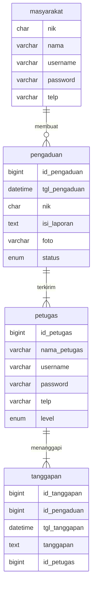

## 1.1 Latar Belakang

 Saya diprojek ini membuat aplikasi pemesanan tiket pesawat. Pemesanan Tiket adalah salah satu proses yang sering banyak orang lakukan sebelum melaksanakan perjalanan atau keberangkatan. Cara yang sering dilakukan para calon penumpang dalam melakukan pemesanan tiket adalah dengan cara memesan di aplikasi pemesanan tiket.
        Pemesanan Tiket ini memudahkan seseorang untuk membeli atau memesan tiket secara online melalui handphone. Jadi seseorang tidak perlu lagi untuk ke agen travel.

## 1.2. Deksripsi Teknologi Informasi

Aplikasi ini bertujuan untuk memudahkan masyarakat untuk berpergian ataupun jalan-jalan didalam negeri maupun diluar negeri. Maka dengan aplikasi ini masyarakat bisa berpergian kapan ajah tanpa harus memesannya di agen-agen.

## 1.3. Branding
 - merk: Pemesanan Tiket
 - Tagline: "kamu mau melakukan perjalanan cepat? pesan di sini ajh."
 - Campaign: Silahkan untuk melakukan pemesanan tiket
 - Target User:
    -Usia: 12+
    -Orang yang ingin melakukan perjalanan cepat sampai tanpa harus memesan tiket di agen.
 -  User Experience Theme:
    -Sederhana
    -Mudah
    -Warna: domain warna biru
    
## 2. User Story

Sebagai | Saya ingin bisa | Sehingga | Prioritas
---|---|---|---
Penguna | Melakukan perjalanan cepat | Bisa cepat sampai | ⭐⭐⭐⭐⭐

## 3. Struktur Data

Cara membuat aneka macam bentuk grafik menggunakan mermaid.js bisa lihat di [https://mermaid.js.org/syntax/entityRelationshipDiagram.html](https://mermaid.js.org/syntax/entityRelationshipDiagram.html) 

## 4. Arsitektur Sistem

Masih pake mermaid.js juga bisa lihat flowchart di [https://mermaid.js.org/syntax/flowchart.html](https://mermaid.js.org/syntax/flowchart.html)

## 5. Teknologi, Library, dan Framework

bla bla bla

## 6. Desain User Experience dan User Interface

Bisa load image 

## 7. Demonstrasi Video

Link youtube nya

## 8. Bagaimana mesin komputasi dan sistem operasi berperan dalam produk teknologi informasimu ?

Link youtube nya di detik jawaban ini

## 9. Bagaimana algoritma, struktur data, dan bahasa pemrograman berperan dalam produk teknologi informasimu ?

Link youtube nya di detik jawaban ini

## 10. Bagaimana metode pengembangan perangkat lunak / Software Development Life Cycle berperan dalam produk teknologi informasimu ?

Link youtube nya di detik jawaban ini

## 11. Bagaimana database / sistem basis data berperan dalam produk teknologi informasimu ?

Link youtube nya di detik jawaban ini
